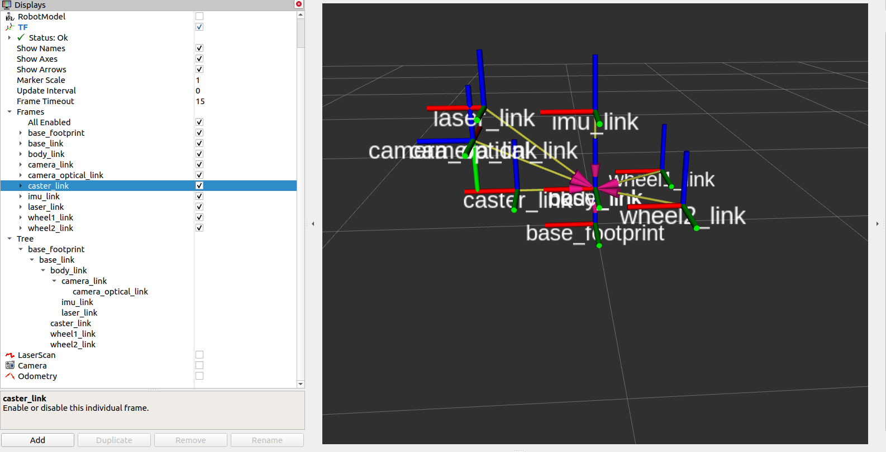
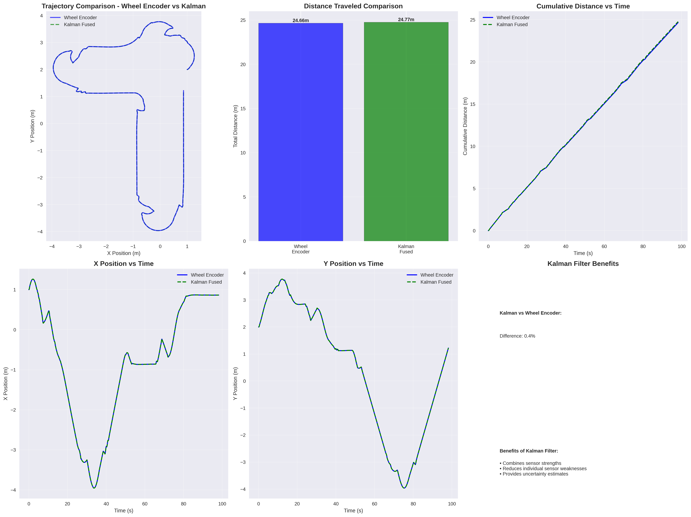
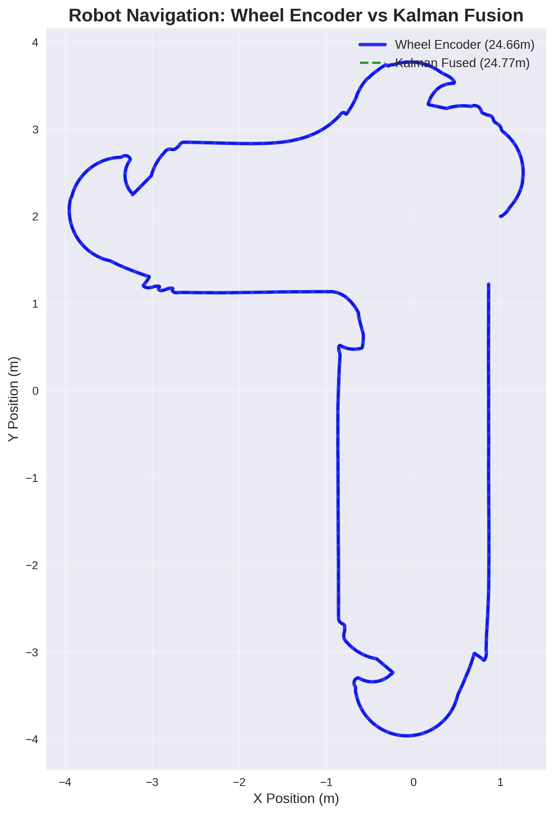

# Differential-Drive Sensor Fusion & Mapping

This project simulates a **differential-drive robot** in a Gazebo apartment-like environment to study **odometry**, **trajectory tracking**, and **sensor fusion**. The robot is equipped with **LiDAR** and **wheel encoders**, uses **PD control** to follow walls, completes a loop, and compares **wheel odometry** with **Kalman-filtered trajectories**.

---

## Features

- Wall-following using **PD control**.
- Trajectory comparison: **Wheel odometry vs Kalman filter**.
- Real-time visualization with **RViz2**.
- Data logging for post-analysis.

---

## Environment Setup

- **ROS 2 Distro**: Foxy Fitzroy
- **Gazebo Version**: 11.11.0
- **RViz2**: Installed
- **Colcon**: Installed
- **Python Version**: ≥ 3.8

---

## Dependencies

### ROS 2 Packages

| Package              | Purpose                        |
| -------------------- | ------------------------------ |
| `geometry_msgs`      | Twist, Pose messages           |
| `sensor_msgs`        | LaserScan, IMU messages        |
| `nav_msgs`           | Odometry messages              |
| `gazebo_msgs`        | ModelStates for ground truth   |
| `rclpy`              | ROS 2 Python client library    |
| `tf_transformations` | Quaternion ↔ Euler conversions |
| `launch_ros`         | Launching ROS 2 nodes          |

### Python Libraries

| Library      | Purpose                              |
| ------------ | ------------------------------------ |
| `numpy`      | Numerical computations               |
| `matplotlib` | Plotting trajectories and distances  |
| `csv`        | Logging distance and trajectory data |
| `os`         | File path management                 |
| `datetime`   | Timestamping data                    |

**Install Python dependencies**:

```bash
pip3 install numpy matplotlib
```

---

## Setup Instructions

Run the provided setup script to install ROS 2 Foxy, Gazebo 11, required ROS 2 packages, and Python dependencies:

```bash
chmod +x setup.sh
./setup.sh
```

---

## Launching the Simulation

### 1. Build the workspace

```bash
cd ~/ws_mobile

# Optional: clean previous builds
rm -rf build/ install/ log/

# Build all packages
colcon build

# Source the workspace
source install/setup.bash

ros2 launch mobile_robot gazebo_model.launch.py
```


### 2. Run Wall-Following Algorithm

```bash
cd ~/ws_mobile/wall_follower_robot/wall_follower_robot

# Run the Python node
python3 wall_following_robot.py
```

---

## Project Structure

```
ws_mobile/
├─ wall_follower_robot/
│  ├─ wall_following_robot.py
├─ mobile_robot/
│  ├─ model/
│  │  └─ robot.xacro
|  ├─ congif
│  │  └─ robot.rviz
│  ├─ launch/
│  │  └─ gazebo_model.launch.py
│  ├─ gazebo_worlds/
│  │  └─ apartment.world
└─ setup.sh
```

---

## Visualization

- Use **RViz2** to monitor robot trajectory, laser scans, and odometry.
- Compare trajectories recorded from **wheel odometry** and **Kalman filter**.

---

# Design Overview

This project implements a comprehensive **differential drive mobile robot simulation** featuring a complete sensor suite integrated with **Gazebo** and **RViz**. The robot serves as a versatile platform for **autonomous navigation and perception tasks** in indoor environments.

---

## Robot Architecture

### Mechanical Design

- **Base Configuration:** Differential drive with two active wheels and one passive caster
- **Dimensions:** 1.0m × 0.6m × 0.3m rectangular chassis
- **Wheel Setup:** Two 0.3m diameter drive wheels with 0.4m separation
- **Ground Clearance:** 0.15m with proper weight distribution

### Sensor Integration

- **LiDAR:** 360° laser scanner mounted on top, 10m range, 360 samples
- **RGB Camera:** Front-mounted, 640×480 resolution at 30 FPS
- **IMU:** 6-DOF inertial measurement unit for orientation tracking
- **Wheel Encoders:** Integrated in differential drive system for odometry

---

## Key Design Decisions

### Frame Hierarchy & Transforms

- Root frame: **`base_footprint`** (projection of robot on ground)
- **`base_link`** sits at wheel height (0.15m above ground)
- Provides a stable reference for all sensors and components
- Enables accurate coordinate transformations for **sensor fusion**

### Sensor Positioning Strategy

- **LiDAR:** Highest point (chassis top + 0.02m) → maximizes field of view, reduces occlusions
- **Camera:** Front edge at moderate height → optimal forward vision
- **IMU:** Geometric center of chassis → minimizes rotational bias effects

### Physics & Dynamics

- Inertial properties derived from **aluminum density (2710 kg/m³)**
- Differential drive with realistic **friction coefficients**
  - Drive wheels: μ = 1.0 (traction)
  - Caster wheel: μ = 0.0 (free-rolling)
- Includes **damping and friction parameters** for stable simulation

### Gazebo Integration

- Each sensor uses a dedicated **Gazebo plugin** with realistic noise models:
  - **LiDAR:** Gaussian noise (σ = 0.01m)
  - **Camera:** 0.7% image noise
  - **IMU:** Bias + Gaussian noise simulation
- Differential drive plugin:
  - Publishes **wheel odometry**
  - Handles **topic remapping** for modular integration

---

### Image of a tf tree showing the relation and transform between various links, sensors etc on the robot.





# Sensor Fusion & Trajectory Tracking

This package implements **sensor fusion** for a differential drive robot in ROS 2, combining **wheel encoder odometry** with a **Kalman filter** to improve trajectory estimation. The node also integrates **Gazebo ground truth** for benchmarking and generates detailed analysis plots comparing different trajectory estimation methods.

---

## Features

- **Fused Trajectory**: Wheel encoder odometry fused using a Kalman filter.
- **Trajectory Comparison**:
  - Raw wheel encoder odometry
  - Kalman-filtered fused odometry
  - Ground-truth trajectory from Gazebo
- **Analysis Outputs**:
  - Trajectory plots (`wheel vs kalman vs ground truth`)
  - Distance traveled comparison
  - Cumulative distance over time
  - Position vs time plots
  - Clean navigation map overlay
- **CSV Logging**: All trajectories (wheel, Kalman, GT) are saved in timestamped CSV files.

---

## Package Structure

- `wheel_distance_tracker.py` → Main ROS 2 node
- `output_dir/` → Auto-created folder with:
  - `wheel_encoder_distance.csv`
  - `kalman_fused_distance.csv`
  - `ground_truth.csv`
  - `wheel_kalman_analysis.png`
  - `navigation_map_clean.png`

---

## Methodology

- **Wheel Odometry**: Provides raw incremental motion estimates but accumulates drift.
- **Kalman Filter Fusion**:
  - State vector includes position `(x, y)`, velocity `(vx, vy)`, orientation `(θ)`, and angular velocity `(ω)`.
  - Wheel odometry updates serve as measurements.
  - Process & measurement noise covariance tuned for realism.
  - Corrects drift and smooths trajectory.

---

## Comparison & Justification

- **Wheel Encoder Only**:
  - Simple, low-cost
  - Accumulates drift & error over long runs
- **Kalman Fusion**:
  - Reduces drift, smooths trajectory
  - Provides uncertainty estimates
  - Better alignment with ground truth
- **Chosen Approach**: Kalman fusion was selected because it balances **real-time performance** with **improved accuracy** in indoor navigation tasks.

---

## Example Output

### Trajectory Comparison



### Clean Navigation Map



---

## License

This project is released under the MIT License.

---

## Author

Dhanushya
